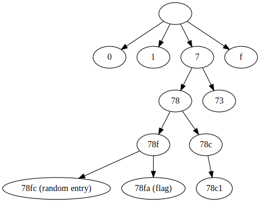

## Introduction
You are provided a link to the challenge website. You may type in some text (called the secret) and when you share it you get link to view it again. 

The website also provides a link to the source code:

```javascript
var express = require('express');
var path = require('path');
var bodyParser = require('body-parser')
var fs = require('fs');
const {SHA256} = require("sha2");


var app = express();
app.use(bodyParser.urlencoded({extended: false}));


var MongoClient = require('mongodb').MongoClient;
const mongo_url = 'mongodb://localmongo';
const db_name = 'secrets';
const db_client = new MongoClient(mongo_url);


db_client.connect(function(err) { 
    db = db_client.db(db_name);
    collection = db.collection("secrets")
    app.listen(8080);
});


app.get('/', function(request, response) {
    response.sendFile(path.join(__dirname + '/html/index.html'));
});


app.post('/secret_share', function(request, response) {
    let sec = request.body.sec;
    let secid = SHA256(sec).toString("hex");
    if (sec.toLowerCase().includes("csr")) {
        response.redirect('/');
    } else {
        collection.insertOne({id: secid, secret: sec});
        response.redirect('/secret_share?secid=' + secid);
    }
});


app.get('/secret_share', function(request, response) {
    var secid = request.query.secid;
    var sec = collection.findOne({id: secid});
    sec.then(sec => {
        fs.readFile(__dirname +'/html/secret.html', {encoding: 'utf-8'}, (err, data) => {
            try {
                response.send(data.replace("$secret", sec["secret"]));
                response.end();
            } catch(e){
                console.log("Error: " + e);
                response.status(404);
                response.send("id does not exist.");
                response.end();
            }
        });        
    }, error => {
        console.log(error);
    });
});


app.get('/source', function(request, response) {
    fs.readFile(__filename, {encoding: 'utf-8'}, (err, data) => {
        response.type("text/plain");
        response.send(data);
        response.end();
    });
});
```

## Finding the vulnerability
When you look to the source code you may see that you input (the secret) is saved to a NoSQL database (mongodb). Its getting saved with a id which is the sha256 hash of the input.
To retrieve your secret again you have to visit /secret_share and send the hash as a GET parameter. The parameter secid from the GET request is used to find the correct entry in the database

After making an own simple nodejs express web and playing arround with the get parameter we've find out that when using an paramter like ```?secid[test]=test``` a javascript object 
```javascript
{
    test: 'test'
}
```
is returned for request.query.secid. This object is then directly passed to the NoSQL query

## Exploiting the vulnerability
As we are able to control a javascript object which is passed to the NoSQL query we can do a NoSQL-Injection and using the mongodb query operators (https://docs.mongodb.com/manual/reference/operator/query/).
However we can only apply the operators to the search after the sha256 hash but not the secret itself. 
As a hash differes greatly even when the difference between the input is only small we have no advantage by knowing the start of the each flag. 
Our only idea was to dump the entries of the database until we find our flag.

We used the input ```?secid[$regex]=^``` to get every entry where the hash starts with a specific sequence. 
However findOne only returns the entry which were found first in the database.
That leads to the problem if the hash of the flag begins with the same sequence as the hash of a random entry we would never find the flag if we choose a start sequence wich is too short:
```
start sequence: 78fc4a

78fc4a5 random entry
78fc4a3 the flag
```

Our next approach was to get a set of every entry in the database minus the the entries we define (think in datasets in term of computer science/mathematics).
The server will display us the first entry in the found dataset which we add to the dataset of entries we don't want in further requests.
In this way we are able to dump every entry once by once.
We've implemented that with the mongodb query operator  ```$not: { $regex: ''}}``` and each time we've got an entry which is not the flag we added the hash to the regex like this:
```?secid[$not][$query]=hash1|hash2|hash3|...```
After dumping like 200 entries we've got a HTTP error that the uri of our request was too long. So we stopped this approach.

Unsatisfied that we still weren't able to get the flag I took a short brake and thought deeper of our problem. 
With some divine inspiration I've started to see the hashes like a tree structure (the hashes are just examples):



The problem of finding the correct hash is now a tree traversal task. We start from the top node and traversal each node until we've find the flag. 
For optimization I also added following rule:

* If a node has only one child node we assume it's going to result in only one hash so we dont traversal the path of the child node

We've paralized the traversal by starting an own process for every node in the first layer (0, 1, 2, ..., f). Th solution code used in the competition can be found here: [secure_secret_sharing.py](secure_secret_sharing.py)

The result was ```62156 CSR{We_Call_Him_Little_Bobby_NoTables}```.
